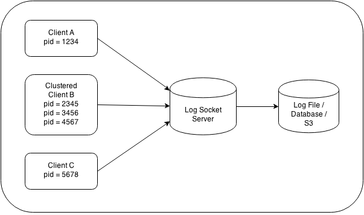

# Socket Logger
- - -

A central log target implemented in unix sockets that consolidates multiple service container logs on a single machine.

## Overview

SocketLogger provides a log target that accepts domain specific log statements and writes them to a centralized destination.  The log server creates a listener socket that reads log statements from a logger client.  As a client, or log statement publisher, there is a LogManager that acts as a log factory to create logs by category (e.g., class name).  Each log may have individual log levels that include debug, info, warn, error, and fatal.

## Installation

	npm install socket-logger --save
	
## Use

### Creating a Target Server

	var SocketLogger = require('socket-logger');
	
	var opts = {
		socketFile:'./logs/socket-logger.sock'
	};
	
	var logger = new SocketLogger( opts );
	
	logger.start();
	

### Creating a Client

	var SocketLogger = require('socket-logger');
	
	var opts = {
		socketFile:'./logs/socket-logger.sock'
	};
	
	var logger = new SocketLogger( opts );
	
	var logManager = logger.createLogManager('MyApplicationName');
	
	var log = logManager.createLogger( 'MyClassName', 'info' );

## Log Manager

## Log Client

- - -
_<small>Copyright (c) 2014, rain city software | Version 00.90.11</small>_
